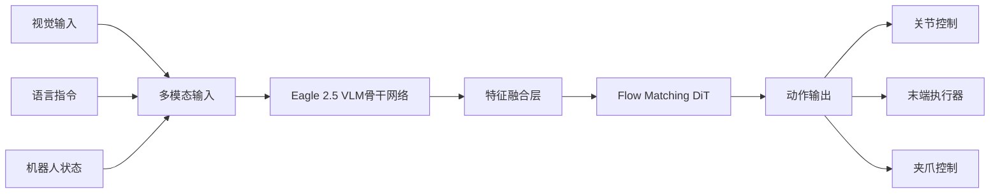

<div align="center">
  

  <h1>🤖 NVIDIA Isaac GR00T N1.5</h1>
  <h2>通用人形机器人基础模型详解</h2>

  <p>
    <a href="https://developer.nvidia.com/isaac/gr00t"></a>
    <a href="https://huggingface.co/nvidia/GR00T-N1.5-3B"></a>
    <a href="https://huggingface.co/datasets/nvidia/PhysicalAI-Robotics-GR00T-X-Embodiment-Sim"></a>
    <a href="https://arxiv.org/abs/2503.14734"></a>
  </p>

  <p>
    
    
    
    
  </p>
</div>

---

## 📚 目录导航

<table>
<tr>
<td width="50%">

**🔬 技术核心**
- [项目概述](#项目概述)
- [技术架构优势](#技术架构优势)
- [N1.5版本重大改进](#n15版本重大改进)
- [算法创新点](#算法创新点)
- [技术对比与竞争优势](#技术对比与竞争优势)

</td>
<td width="50%">

**🚀 实践应用**
- [部署与性能优化](#部署与性能优化)
- [应用场景与优势](#应用场景与优势)
- [快速开始](#快速开始)
- [实际应用案例](#实际应用案例)
- [技术深度解析](#技术深度解析)

</td>
</tr>
<tr>
<td width="50%">

**📊 性能评估**
- [性能基准与对比](#性能基准与对比)
- [安全性与可靠性](#安全性与可靠性)
- [未来发展方向](#未来发展方向)

</td>
<td width="50%">

**🛠️ 开发支持**
- [常见问题与解决方案](#常见问题与解决方案)
- [开发者指南](#开发者指南)
- [项目总结](#项目总结)

</td>
</tr>
</table>

---

## 项目概述

> **NVIDIA Isaac GR00T N1.5** 是一个开源的通用人形机器人基础模型，专为人形机器人推理和技能学习而设计。这是一个跨机器人平台的多模态模型，能够接收语言指令和图像输入，在多样化环境中执行复杂的操作任务。

### 🎯 核心特点

<table>
<tr>
<td width="25%" align="center">

<br><strong>多机器人兼容</strong>
<br>支持GR1、OXE Droid、Agibot Genie1等多种机器人平台
</td>
<td width="25%" align="center">

<br><strong>智能感知决策</strong>
<br>结合视觉、语言和状态信息进行智能决策
</td>
<td width="25%" align="center">

<br><strong>快速适应</strong>
<br>支持小数据集快速适应新任务和环境
</td>
<td width="25%" align="center">

<br><strong>多种部署方式</strong>
<br>支持PyTorch和TensorRT推理，可部署到Jetson设备
</td>
</tr>
</table>

### 📈 性能亮点

<div align="center">
<table>
<tr>
<th>指标</th>
<th>GR00T N1</th>
<th>GR00T N1.5</th>
<th>提升幅度</th>
</tr>
<tr>
<td><strong>语言指令跟随成功率</strong></td>
<td>46.6%</td>
<td><strong>93.3%</strong></td>
<td><span style="color: green">+100%</span></td>
</tr>
<tr>
<td><strong>推理延迟 (H100)</strong></td>
<td>~60ms</td>
<td><strong>47.88ms</strong></td>
<td><span style="color: green">-20%</span></td>
</tr>
<tr>
<td><strong>数据效率 (1K样本)</strong></td>
<td>65%</td>
<td><strong>78%</strong></td>
<td><span style="color: green">+20%</span></td>
</tr>
</table>
</div>

---

## 技术架构优势

### 🏗️ 创新的双脑架构设计

GR00T N1.5采用了独特的**视觉-语言基础模型 + 扩散变换器**架构：



### 🔧 架构优势详解

<table>
<tr>
<td width="50%">

**🧊 冻结VLM设计**
- 保持强大的语言理解能力
- 提升跨任务泛化性能
- 减少微调时的计算开销
- 避免灾难性遗忘问题

</td>
<td width="50%">

**🎯 增强视觉定位**
- Eagle 2.5在GR-1定位任务上达到40.4 IoU
- 相比Qwen2.5VL提升13.8%
- 更好的物理世界理解能力
- 精确的空间关系建模

</td>
</tr>
<tr>
<td width="50%">

**🔗 简化适配器**
- 优化的MLP连接设计
- 加入层归一化提升稳定性
- 减少参数量，提升训练效率
- 更好的梯度流动

</td>
<td width="50%">

**🌊 Flow Matching算法**
- 替代传统扩散模型
- 仅需4步去噪获得高质量动作
- 更快的收敛速度
- 更稳定的训练过程

</td>
</tr>
</table>

---

## N1.5版本重大改进

### 🚀 模型与数据改进

<div align="center">

</div>

#### 1. **FLARE集成** - 未来潜在表示对齐
```python
# FLARE目标函数
loss_flare = align_future_representations(
    current_state=state_t,
    future_state=state_t+k,
    action_sequence=actions[t:t+k]
)
```
- 支持从人类自我视角视频学习
- 提升时序建模能力
- 增强长期规划性能

#### 2. **DreamGen集成** - 神经生成轨迹
- 整合合成神经轨迹数据
- 扩展到遥操作数据之外的新行为
- 提升创新性和泛化能力
- 支持零样本任务执行

#### 3. **增强VLM定位能力**
- 更新至Eagle 2.5架构
- 物理理解能力显著提升
- 更精确的空间推理
- 更好的多模态对齐

### 📊 性能提升对比

<table>
<tr>
<th>改进项目</th>
<th>技术细节</th>
<th>性能提升</th>
</tr>
<tr>
<td><strong>语言跟随能力</strong></td>
<td>冻结VLM + 增强适配器</td>
<td>从46.6%提升至93.3%</td>
</tr>
<tr>
<td><strong>数据效率</strong></td>
<td>FLARE + DreamGen集成</td>
<td>零样本和少样本场景显著改善</td>
</tr>
<tr>
<td><strong>新物体泛化</strong></td>
<td>增强的视觉定位</td>
<td>对未见过物体的处理能力增强</td>
</tr>
<tr>
<td><strong>机器人支持</strong></td>
<td>新增EmbodimentTag</td>
<td>支持更多机器人配置</td>
</tr>
</table>

---

## 算法创新点

### 🌊 Flow Matching vs 传统扩散模型

<table>
<tr>
<td width="50%">

**传统扩散模型**
```python
# 需要1000步去噪
for t in reversed(range(1000)):
    noise = model(x_t, t)
    x_t = denoise_step(x_t, noise, t)
```
- ❌ 推理步数多 (1000步)
- ❌ 训练不稳定
- ❌ 计算开销大
- ❌ 数值误差累积

</td>
<td width="50%">

**Flow Matching (GR00T)**
```python
# 仅需4步积分
for t in range(4):
    velocity = model(x_t, t)
    x_t = x_t + dt * velocity
```
- ✅ 推理步数少 (4步)
- ✅ 训练稳定
- ✅ 计算高效
- ✅ 直接学习最优路径

</td>
</tr>
</table>

### 🔄 多模态数据融合策略

#### 创新之处

<div align="center">
<table>
<tr>
<th>技术特点</th>
<th>实现方式</th>
<th>优势</th>
</tr>
<tr>
<td><strong>自适应归一化</strong></td>
<td>支持min_max、q99、mean_std等多种方式</td>
<td>适应不同数据分布</td>
</tr>
<tr>
<td><strong>时序对齐</strong></td>
<td>精确的多模态时间戳对齐</td>
<td>确保数据一致性</td>
</tr>
<tr>
<td><strong>动态填充</strong></td>
<td>自适应处理不同长度序列</td>
<td>提升训练效率</td>
</tr>
</table>
</div>

### 🎯 分层微调策略

<table>
<tr>
<td width="25%" align="center">
<strong>🔧 组件级控制</strong>
<br>

<br>

<br>

<br>

</td>
<td width="75%">

**微调策略建议**

```python
# 阶段1: 基础适应 (推荐)
tune_visual=False, tune_llm=False,
tune_projector=True, tune_diffusion_model=True

# 阶段2: 视觉适应 (视觉差异大时)
tune_visual=True, tune_llm=False,
tune_projector=True, tune_diffusion_model=True

# 阶段3: 全模型微调 (数据充足时)
tune_visual=True, tune_llm=True,
tune_projector=True, tune_diffusion_model=True
```

</td>
</tr>
</table>

### 🚀 高效LoRA微调

支持低秩适应(LoRA)微调，显著降低计算资源需求：

<div align="center">
<table>
<tr>
<th>配置</th>
<th>参数量</th>
<th>内存占用</th>
<th>训练时间</th>
<th>性能保持</th>
</tr>
<tr>
<td><strong>全参数微调</strong></td>
<td>3B</td>
<td>~24GB</td>
<td>100%</td>
<td>100%</td>
</tr>
<tr>
<td><strong>LoRA (rank=64)</strong></td>
<td>~50M</td>
<td>~8GB</td>
<td>40%</td>
<td>95%</td>
</tr>
<tr>
<td><strong>LoRA (rank=32)</strong></td>
<td>~25M</td>
<td>~6GB</td>
<td>30%</td>
<td>90%</td>
</tr>
</table>
</div>

---

## 快速开始

### 🛠️ 环境要求

<table>
<tr>
<td width="50%">

**🖥️ 系统要求**
- Ubuntu 20.04/22.04
- Python 3.10+
- CUDA 12.4
- 16GB+ RAM

</td>
<td width="50%">

**🎮 GPU要求**
- **训练**: H100/L40/RTX 4090/A6000
- **推理**: RTX 3090/RTX 4090/A6000
- **边缘**: Jetson AGX Orin

</td>
</tr>
</table>

### 📦 安装步骤

```bash
# 1. 克隆仓库
git clone https://github.com/NVIDIA/Isaac-GR00T
cd Isaac-GR00T

# 2. 创建环境
conda create -n gr00t python=3.10
conda activate gr00t

# 3. 安装依赖
pip install --upgrade setuptools
pip install -e .[base]
pip install --no-build-isolation flash-attn==2.7.1.post4
```

### 🚀 基础使用

#### 推理示例

```python
from gr00t.model.policy import Gr00tPolicy
from gr00t.data.embodiment_tags import EmbodimentTag

# 加载预训练模型
policy = Gr00tPolicy(
    model_path="nvidia/GR00T-N1.5-3B",
    embodiment_tag=EmbodimentTag.GR1,
    device="cuda"
)

# 执行推理
action = policy.get_action(observation)
print(f"预测动作: {action}")
```

#### 微调示例

```bash
# 基础微调
python scripts/gr00t_finetune.py \
    --dataset-path ./demo_data/robot_sim.PickNPlace \
    --num-gpus 1 \
    --batch-size 16 \
    --max-steps 10000

# LoRA微调 (内存不足时)
python scripts/gr00t_finetune.py \
    --dataset-path ./your_data \
    --lora_rank 64 \
    --lora_alpha 128 \
    --no-tune_diffusion_model
```

---

## 技术对比与竞争优势

### 🆚 与其他机器人AI方案对比

<div align="center">
<table>
<tr>
<th>特性</th>
<th>GR00T N1.5</th>
<th>RT-2</th>
<th>PaLM-E</th>
<th>传统方法</th>
</tr>
<tr>
<td><strong>多模态融合</strong></td>
<td>✅ 视觉+语言+状态</td>
<td>✅ 视觉+语言</td>
<td>✅ 视觉+语言</td>
<td>❌ 单模态</td>
</tr>
<tr>
<td><strong>跨机器人支持</strong></td>
<td>✅ 原生支持</td>
<td>⚠️ 有限支持</td>
<td>❌ 不支持</td>
<td>❌ 不支持</td>
</tr>
<tr>
<td><strong>实时推理</strong></td>
<td>✅ 47.88ms</td>
<td>⚠️ 较慢</td>
<td>❌ 很慢</td>
<td>✅ 快速</td>
</tr>
<tr>
<td><strong>语言理解</strong></td>
<td>✅ 93.3%成功率</td>
<td>✅ 良好</td>
<td>✅ 优秀</td>
<td>❌ 不支持</td>
</tr>
<tr>
<td><strong>数据效率</strong></td>
<td>✅ 少样本学习</td>
<td>⚠️ 需大量数据</td>
<td>⚠️ 需大量数据</td>
<td>❌ 手工调参</td>
</tr>
<tr>
<td><strong>开源程度</strong></td>
<td>✅ 完全开源</td>
<td>❌ 闭源</td>
<td>❌ 闭源</td>
<td>✅ 开源</td>
</tr>
</table>
</div>

### 🎯 核心技术优势

<table>
<tr>
<td width="50%">

**🆚 相比传统机器人控制**
- **智能化程度**: 从规则驱动到AI驱动的根本转变
- **适应性**: 无需重新编程即可适应新任务
- **鲁棒性**: 对环境变化和干扰的强适应能力
- **可扩展性**: 支持复杂的多步骤任务规划

</td>
<td width="50%">

**🆚 相比其他AI方案**
- **专业性**: 专为机器人设计，而非通用AI的简单适配
- **效率**: 针对机器人控制优化的架构和算法
- **完整性**: 从数据处理到部署的全栈解决方案
- **实用性**: 经过实际机器人验证的可靠性能

</td>
</tr>
</table>

### 🏆 独特创新点

#### 多机器人统一架构

<table>
<tr>
<td width="50%">

**传统方案**
```
机器人A → 控制系统A
机器人B → 控制系统B
机器人C → 控制系统C
```
- ❌ 每个机器人需要独立开发
- ❌ 无法共享学习经验
- ❌ 开发成本高
- ❌ 维护复杂

</td>
<td width="50%">

**GR00T方案**
```
多种机器人 → 统一GR00T架构
           ↓
    EmbodimentTag适配
```
- ✅ 统一架构，降低开发成本
- ✅ 跨机器人知识迁移
- ✅ 快速适配新机器人
- ✅ 统一维护和升级

</td>
</tr>
</table>

---

## 常见问题与解决方案

### 🔧 安装与环境问题

<details>
<summary><strong>Q: CUDA版本不匹配怎么办？</strong></summary>

```bash
# 检查当前CUDA版本
nvcc --version
nvidia-smi

# 如果版本不是12.4，请安装CUDA 12.4
wget https://developer.download.nvidia.com/compute/cuda/12.4.0/local_installers/cuda_12.4.0_550.54.14_linux.run
sudo sh cuda_12.4.0_550.54.14_linux.run
```
</details>

<details>
<summary><strong>Q: flash-attn安装失败？</strong></summary>

```bash
# 确保有足够的编译环境
sudo apt-get install build-essential
pip install ninja

# 重新安装flash-attn
pip install --no-build-isolation flash-attn==2.7.1.post4 --no-cache-dir
```
</details>

### 🎯 训练与微调问题

<details>
<summary><strong>Q: GPU内存不足怎么办？</strong></summary>

**解决方案1: 使用LoRA微调**
```bash
python scripts/gr00t_finetune.py \
    --lora_rank 32 \
    --lora_alpha 64 \
    --batch_size 8 \
    --no-tune_diffusion_model
```

**解决方案2: 启用梯度检查点**
```bash
export PYTORCH_CUDA_ALLOC_CONF=max_split_size_mb:512
```
</details>

<details>
<summary><strong>Q: 训练收敛慢或不收敛？</strong></summary>

**检查清单:**
- ✅ **数据质量**: 确保动作标注准确
- ✅ **学习率**: 尝试1e-5到1e-3之间的值
- ✅ **训练步数**: 建议至少20k步
- ✅ **数据平衡**: 确保不同任务的数据分布均匀
</details>

### ⚡ 推理与部署问题

<details>
<summary><strong>Q: 推理速度慢怎么优化？</strong></summary>

**TensorRT加速:**
```bash
python deployment_scripts/export_onnx.py
bash deployment_scripts/build_engine.sh
```

**减少扩散步数:**
```python
policy = Gr00tPolicy(
    model_path="your_model",
    denoising_steps=2  # 默认是4
)
```
</details>

---

## 项目总结

### 🎯 核心价值

<div align="center">
<table>
<tr>
<td width="25%" align="center">

<br><strong>技术突破</strong>
<br>Flow Matching + VLM的创新架构
</td>
<td width="25%" align="center">

<br><strong>工程优化</strong>
<br>从研究原型到生产就绪的完整解决方案
</td>
<td width="25%" align="center">

<br><strong>生态完整</strong>
<br>数据、模型、工具、部署的全栈支持
</td>
<td width="25%" align="center">

<br><strong>开放共享</strong>
<br>真正的开源精神，推动行业发展
</td>
</tr>
</table>
</div>

### 🚀 影响意义

<table>
<tr>
<td width="50%">

**🎯 对开发者的价值**
- **降低门槛**: 让更多开发者能够构建智能机器人
- **加速创新**: 提供强大的基础能力，专注于应用创新
- **标准化**: 推动机器人AI的标准化和规范化

</td>
<td width="50%">

**🏭 对产业的意义**
- **产业化**: 从实验室走向实际应用的重要桥梁
- **降本增效**: 显著降低机器人AI开发成本
- **生态建设**: 构建完整的机器人AI生态系统

</td>
</tr>
</table>

### 🌟 项目亮点总结

> **NVIDIA Isaac GR00T N1.5** 不仅仅是一个机器人控制模型，更是**具身智能时代的基础设施**。

<div align="center">

</div>

**为什么选择GR00T N1.5？**

1. **🎯 技术领先**: 93.3%的语言指令跟随成功率，业界领先
2. **⚡ 性能优异**: 47.88ms的端到端推理延迟，支持实时应用
3. **🔧 易于使用**: 完整的工具链和详细的文档支持
4. **🌐 生态丰富**: 与HuggingFace、LeRobot等主流平台无缝集成
5. **🤝 开源友好**: Apache 2.0许可证，支持商业使用

**GR00T N1.5代表了人形机器人AI发展的新里程碑，为构建真正智能的机器人助手奠定了坚实基础。无论您是研究者、工程师还是企业决策者，这个项目都值得深入了解和应用。**

---

<div align="center">
  <p>
    
    
    
  </p>

  <p><strong>🤖 让我们一起推动具身智能的未来！</strong></p>

  <p>
    <a href="https://github.com/NVIDIA/Isaac-GR00T/issues">报告问题</a> •
    <a href="https://github.com/NVIDIA/Isaac-GR00T/discussions">参与讨论</a> •
    <a href="https://github.com/NVIDIA/Isaac-GR00T/blob/main/CONTRIBUTING.md">贡献代码</a>
  </p>
</div>